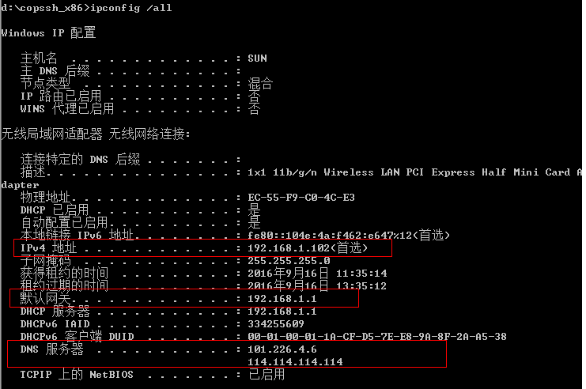
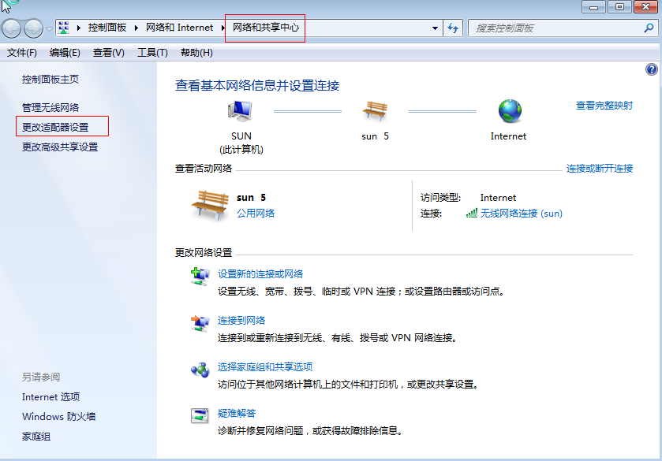
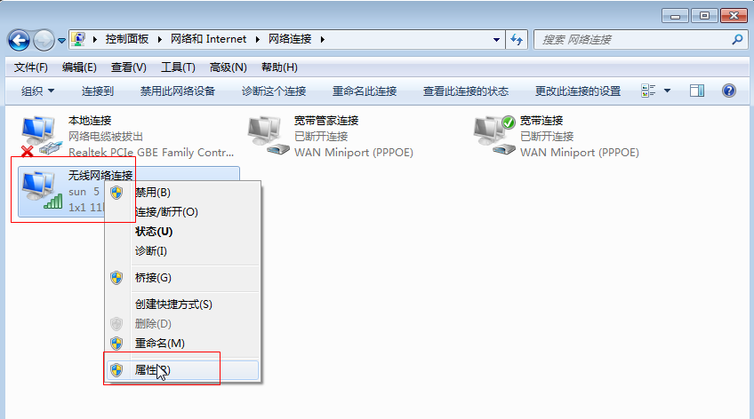
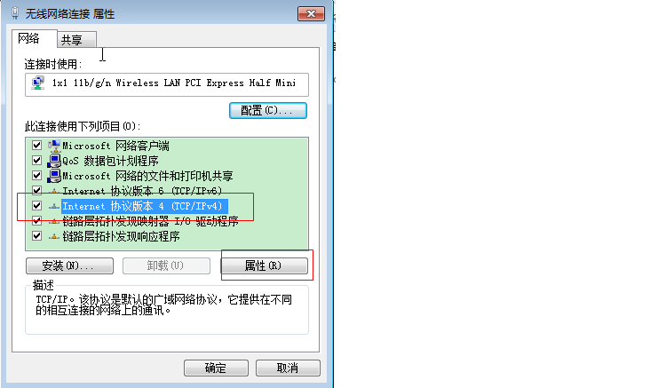
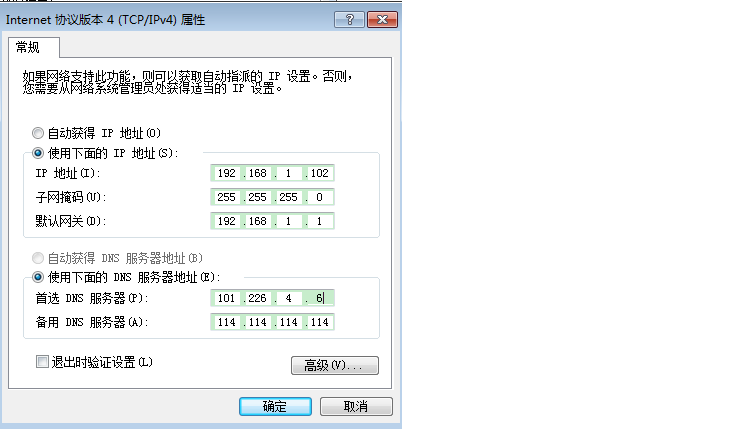

###将无线网卡设置为固定IP地址
无线网卡一般使用自动获取IP地址的方式连接，但我有需要使用固定IP地址的需要。可以根据无线网卡自动获取的IP信息将其设置为固定的IP。
####1. 获取当前信息
#####获取无线网卡自动获得IP地址的一些信息，主要是当前IP地址、首选DNS服务器和备选DNS服务器。
如果一个无线路由器中已有多台设备连接，使用当前自动获取的IP地址作为固定IP地址，可以保证IP地址不会与其他设备发生冲突。首选DNS服务器为必填项，否则可能导致无法连接外网。

#####首先， 在cmd中输入 ipconfig /all 命令，可以获得红框中的信息,如下图所示：

#####然后，打开 网络共享中 ->更改网络适配器， 如下图所示:

#####选中所需要设置固定IP的无线网卡，右键 -> 属性

#####选中 网络 -> Internet 协议版本4(TCP/IPv4) -> 属性

##### 将从上面获取的IP和DNS信息填到对应的框中

##### 点击确定，大功告成！

